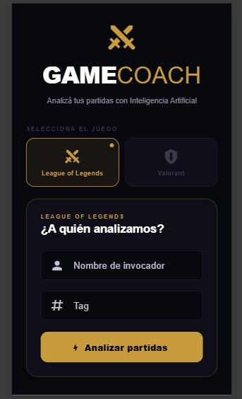
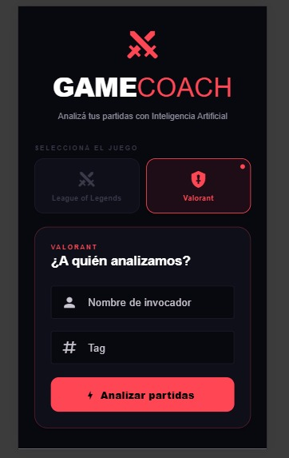
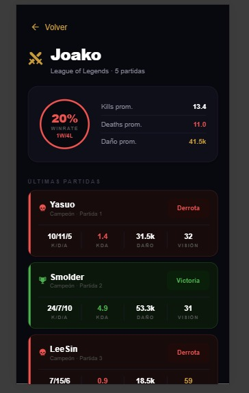
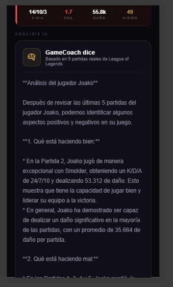

# GameCoach Frontend

React Native app that displays AI-powered coaching analysis 
for League of Legends and Valorant players.

## Stack
- React Native 0.81.5
- Expo 54
- TypeScript 5.9
- NativeWind 4 (Tailwind CSS)
- React Navigation 7

## Screens
- **Home** — Enter your Riot ID and select a game
- **Result** — View match stats and AI coaching analysis

## Setup
1. Clone the repo
2. Run `npm install`
3. Make sure the backend is running
4. Run `npx expo start`

## Screenshots

